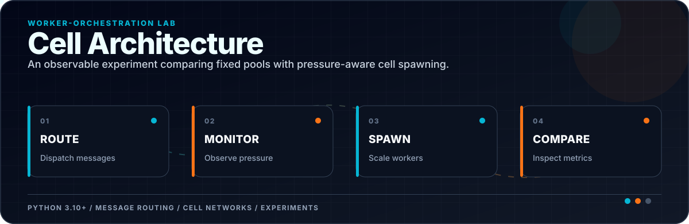
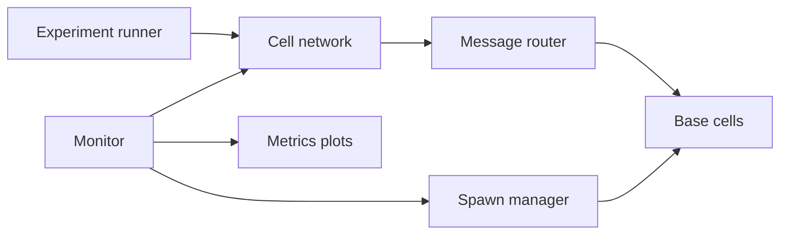
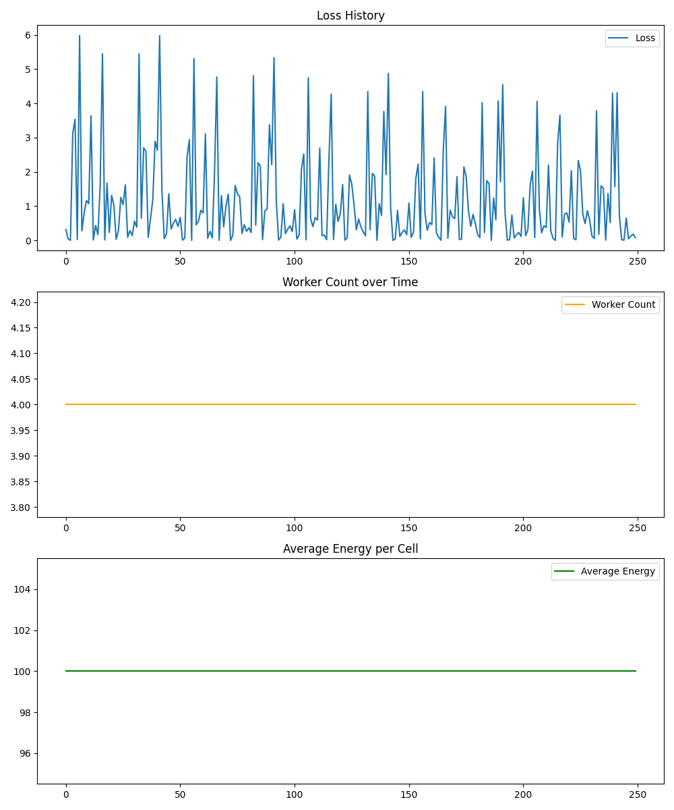
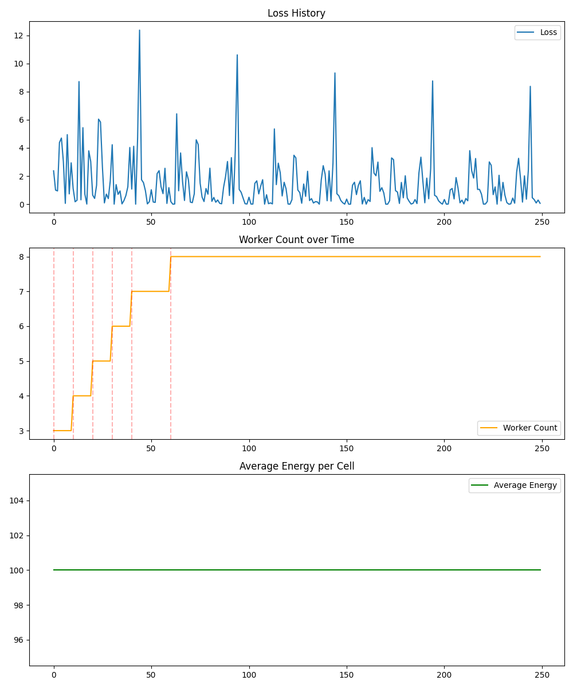

<div align="center">



</div>

[](./cellnet)
[](./cellnet/experiments)
[](#experiment-output)

**A small systems lab for comparing fixed worker pools with cells that can spawn workers from observed pressure.**

The project models a network of independent cells, message routing, worker creation, and runtime monitoring. It is deliberately compact: the goal is to make orchestration decisions observable and compare two strategies under the same workload.

## Design



| Module | Responsibility |
|---|---|
| `core/base_cell.py` | Base worker/cell behavior |
| `core/cell_network.py` | Cell registration and communication |
| `core/message_router.py` | Dispatch to the appropriate worker |
| `core/spawn_manager.py` | Dynamic worker creation policy |
| `core/monitor.py` | Runtime measurements |
| `experiments/` | Fixed and dynamic worker comparisons |

## Run the experiments

```bash
git clone https://github.com/ReaperXD67/Cell_Architecture.git
cd Cell_Architecture
python -m venv .venv
```

Activate the environment, install the packages required by the experiment modules, then run:

```bash
python -m cellnet.experiments.fixed_worker_experiment
python -m cellnet.experiments.dynamic_worker_experiment
```

## Experiment output

| Fixed workers | Dynamic workers |
|---|---|
|  |  |

The images are experiment artifacts, not production benchmarks. Re-run both strategies on the same machine and workload before comparing them.

## Next engineering steps

- Define explicit scale-up/scale-down thresholds and cooldowns.
- Move message delivery to an asynchronous transport.
- Record queue depth, saturation, task latency, and spawn cost in a machine-readable run artifact.
- Add deterministic tests for routing and spawn policy behavior.
